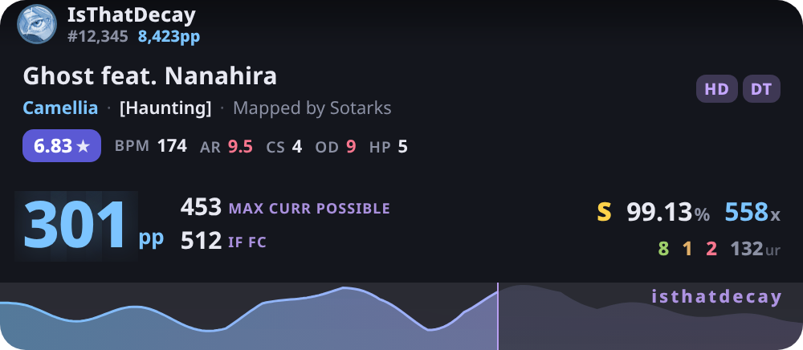

# decay

A chill **osu!std pp counter** overlay for [tosu](https://github.com/tosuapp/tosu), made for
[IsThatDecay](https://osu.ppy.sh/users/15262479). Zero dependencies, zero build step —
just drop it in and go.



---

## Install

1. Grab the `decay` folder (the one with `metadata.txt` in it).
2. Drop it into tosu's counters folder:
   - Open the tosu dashboard (`http://127.0.0.1:24050`) → **Available** → the folder icon opens the counters directory.
   - Put `decay/` inside it.
3. Refresh the dashboard, find **decay**, and copy its URL into an OBS **Browser Source**
   (or use the in-game overlay).
4. Set the browser source size to **500 × 218**.

That's it. Everything below is optional tuning.

---

## What it shows

**Player strip (top)** — auto-filled from whoever's logged into osu!:
- avatar · username · global rank · total pp

**Map** — title, artist, `[difficulty]`, `Mapped by <mapper>`, star rating (difficulty-colored),
BPM, and AR/CS/OD/HP (turn red when mods make them harder, green when easier).

**Performance** — three pp values, because "current pp" alone lies to you:

| label | meaning |
|---|---|
| **`301` (hero)** | pp for the play **right now** (current combo, misses, acc) |
| **`MAX CURR POSSIBLE`** | the best you can **still** reach — misses are locked in, but you play the rest perfectly |
| **`IF FC`** | pp if the play were a full combo (pretends the misses never happened) |

Plus accuracy, live rank, combo, 100/50/miss counts, and unstable rate.

**Strain graph (bottom)** — the map's difficulty curve; the bright blue→purple portion tracks song progress.

---

## Settings

Editable live in the tosu dashboard (gear icon on the counter):

| setting | default | what it does |
|---|---|---|
| Accent color (blue) | `#7cc4ff` | pp number, graph start, highlights |
| Accent color 2 (purple) | `#c4a6ff` | mod chips, graph end, labels |
| Tagline | `isthatdecay` | watermark over the graph (blank = hidden) |
| Show player strip | on | avatar / name / rank / pp bar |
| Show session stats | **off** | pp gained + plays this session |
| Show map background | on | blurred beatmap bg |
| Show unstable rate | on | live UR during play |
| Show SS pp instead of if-FC | off | swap the `IF FC` value for SS (100%) pp |
| Dim when paused | on | gently dims when paused/unfocused |
| 100 / 50 / miss colors | greens/gold/red | judgement counter colors |

---

## Dev

Everything in `dev/` is for local development without osu! running:

```bash
dev/shots.sh            # start a fake tosu server + screenshot menu/play/result
dev/show.sh             # preview those screenshots inline (needs tpix)
node dev/mock-tosu.js   # run the fake server standalone on :24050
```

- `mock-tosu.js` — a zero-dependency fake tosu server (hand-rolled websockets) that
  simulates a menu → play → result loop, so you can develop the counter with no game.
- `?mockScene=menu|play|result` on the counter URL renders a static fixture (used for screenshots).

---

## Notes / credits

- Built against tosu's **v2** websocket API (`/websocket/v2`).
- The `MAX CURR POSSIBLE` / `IF FC` semantics mirror tosu's `pp.maxAchievable` / `pp.fc`.
- Colors: light blue + light purple, Decay's picks.
- by River ([TogiFerretFerret](https://github.com/TogiFerretFerret)) 🩵💜
